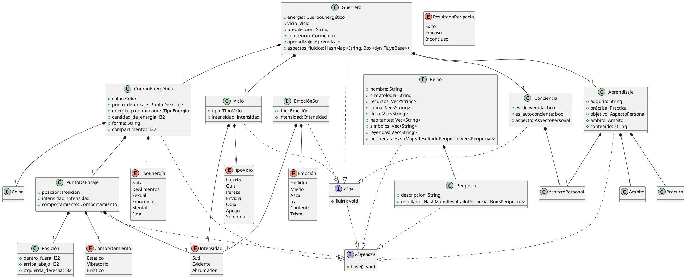

# Documentation for `estructuras.rs`

This file defines several structs and enums that are part of the application's core data structures.

```plantuml
@startuml

' Enums from enum_unit.rs
enum Emoción {
    Fastidio
    Miedo
    Asco
    Ira
    Contento
    Triste
}

enum Intensidad {
    Sutil
    Evidente
    Abrumador
}

enum TipoVicio {
    Lujuria
    Gula
    Pereza
    Envidia
    Odio
    Apego
    Soberbia
}

enum TipoEnergía {
    Natal
    DeAlimentos
    Sexual
    Emocional
    Mental
    Fina
}

enum Comportamiento {
    Estático
    Vibratorio
    Errático
}

enum ResultadoPeripecia {
    Éxito
    Fracaso
    Inconcluso
}

interface Fluye {
    +fluir(): void
}

interface FluyeBase {
    +base(): void
}

' Structs from estructuras.rs
class EmociónStr {
    +tipo: Emoción
    +intensidad: Intensidad
}

class Vicio {
    +tipo: TipoVicio
    +intensidad: Intensidad
}

class Posición {
    +dentro_fuera: i32
    +arriba_abajo: i32
    +izquierda_derecha: i32
}

class PuntoDeEncaje {
    +posición: Posición
    +intensidad: Intensidad
    +comportamiento: Comportamiento
}

class CuerpoEnergético {
    +color: Color
    +punto_de_encaje: PuntoDeEncaje
    +energia_predominante: TipoEnergía
    +cantidad_de_energia: i32
    +forma: String
    +compartimentos: i32
}

class Conciencia {
    +es_deliverada: bool
    +es_autoconciente: bool
    +aspecto: AspectoPersonal
}

class Aprendizaje {
    +augurio: String
    +práctica: Practica
    +objetivo: AspectoPersonal
    +ambito: Ambito
    +contenido: String
}

class Guerrero {
    +energia: CuerpoEnergético
    +vicio: Vicio
    +predileccion: String
    +conciencia: Conciencia
    +aprendizaje: Aprendizaje
    +aspectos_fluidos: HashMap<String, Box<dyn FluyeBase>>
}

class Peripecia {
    +descripcion: String
    +resultado: HashMap<ResultadoPeripecia, Box<Peripecia>>
}

class Reino {
    +nombre: String
    +climatologia: String
    +recursos: Vec<String>
    +fauna: Vec<String>
    +flora: Vec<String>
    +habitantes: Vec<String>
    +simbolos: Vec<String>
    +leyendas: Vec<String>
    +peripecias: HashMap<ResultadoPeripecia, Vec<Peripecia>>
}

' Relationships
EmociónStr *-- "1" Emoción
EmociónStr *-- "1" Intensidad
Vicio *-- "1" TipoVicio
Vicio *-- "1" Intensidad
PuntoDeEncaje *-- "1" Posición
PuntoDeEncaje *-- "1" Intensidad
PuntoDeEncaje *-- "1" Comportamiento
CuerpoEnergético *-- "1" Color
CuerpoEnergético *-- "1" PuntoDeEncaje
CuerpoEnergético *-- "1" TipoEnergía
Conciencia *-- "1" AspectoPersonal
Aprendizaje *-- "1" Practica
Aprendizaje *-- "1" Ambito
Aprendizaje *-- "1" AspectoPersonal
Guerrero *-- "1" CuerpoEnergético
Guerrero *-- "1" Vicio
Guerrero *-- "1" Conciencia
Guerrero *-- "1" Aprendizaje
Reino *-- "*" Peripecia

' Interface Implementations
EmociónStr ..|> Fluye
Vicio ..|> Fluye
PuntoDeEncaje ..|> FluyeBase
CuerpoEnergético ..|> FluyeBase
Conciencia ..|> Fluye
Aprendizaje ..|> FluyeBase
Guerrero ..|> Fluye
Peripecia ..|> FluyeBase
Reino ..|> FluyeBase
Fluye ..|>  FluyeBase

@enduml
```
